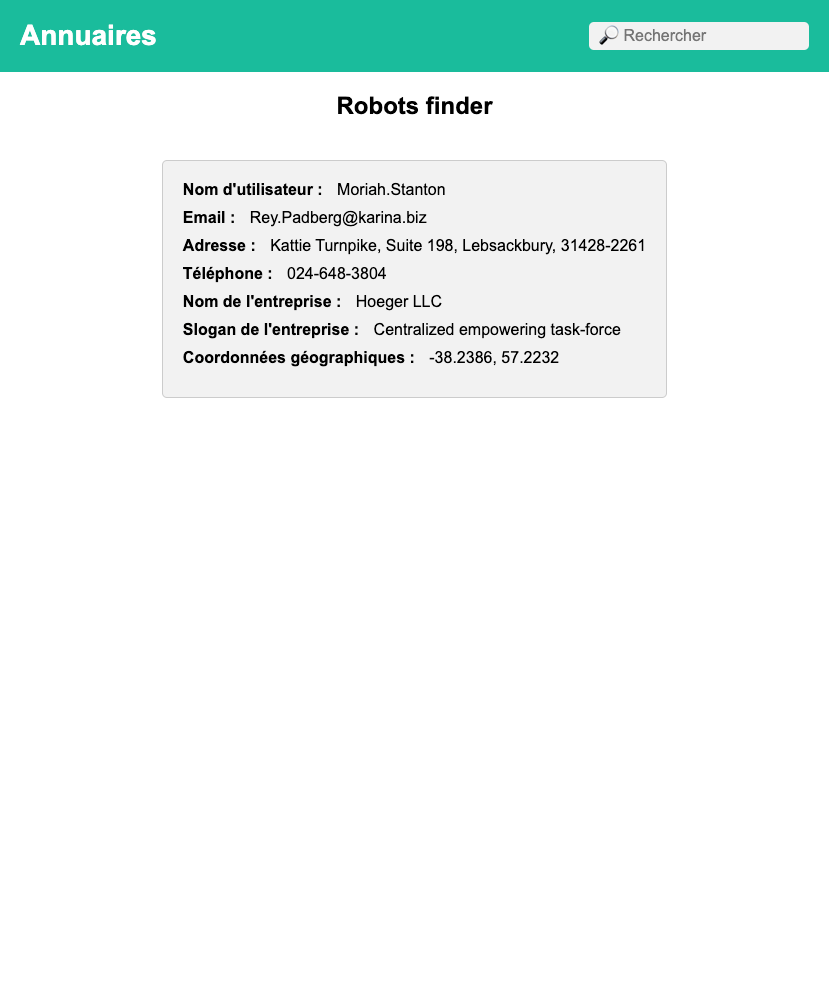

# Robot Finder


[](https://github.com/GorskiAnthony/WCS_RobotFinder)
[](https://twitter.com/Gorski_anthony)
[](https://github.com/GorskiAnthony)

> Nous allons manipuler le DOM en JS ainsi que la mise en production avec github pages.

## Homepage 🏠



## Install ⚙️

```sh
$ git clone {project}
$ cd {project}
```

## But de l'exercice 🎯

Récupérer les informations du DOM (`querySelector` `getElementById` `getElementsByClassName` `getElementsByTagName` `querySelectorAll`)

Ajouter des écouteurs d'événements (`addEventListener`)

## Étape 1️

Toutes les données sont disponibles dans le fichier `data.js` qui est un tableau d'objets.

## Étape 2️

Nous devons récupérer la carte créée dans le fichier `index.html` et l'ajouter dans le fichier `main.js` pour pouvoir l'utiliser.

## Étape 3️

Boucler sur le tableau `data` pour afficher les robots sur la carte.

## Étape 4️

Créer un filtre pour afficher uniquement les robots que l'on souhaite.

## Étape 5️

Mettre en ligne le projet sur github pages.

---

## Author 👤

**Anthony Gorski**

-   Website: [agorski.fr](https://www.agorski.fr)
-   Twitter: [@anthony](https://twitter.com/Gorski_Anthony)
-   Github: [@anthony](https://github.com/GorskiAnthony)
-   LinkedIn: [@anthony](https://linkedin.com/in/anthony-gorski)
